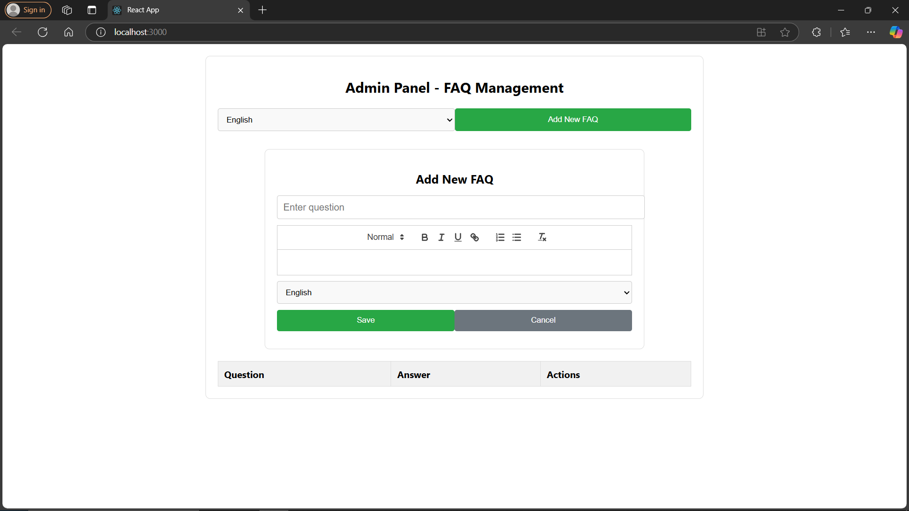
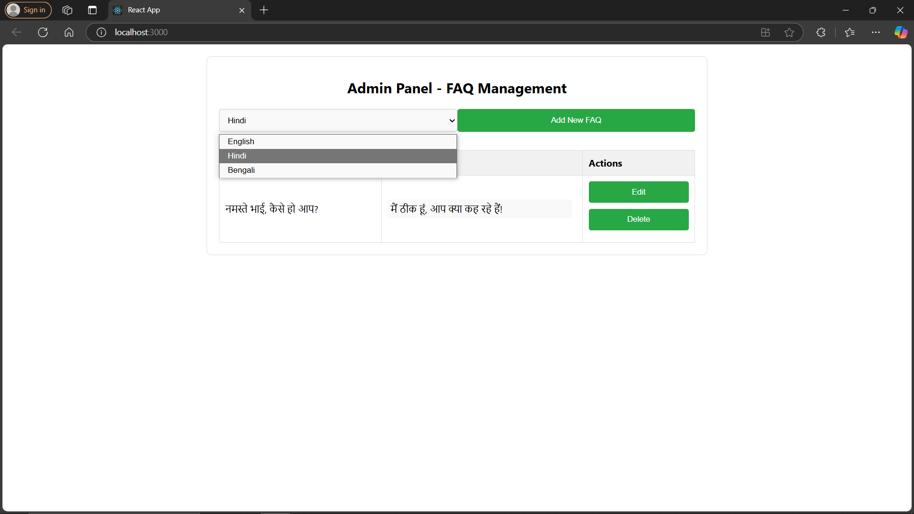

# FAQ API

## Overview
This project is a **FAQ Management System** built using **Express.js**, **MongoDB (Atlas)**, **Redis Cloud**, and **Google Translate API**. It supports **multilingual FAQs** with caching and a WYSIWYG editor for managing FAQ content.

## Features
- **RESTful API** for FAQ management
- **Multilingual support** using Google Translate API
- **Caching with Redis** for improved performance
- **WYSIWYG Editor** using Quill.js for frontend
- **Security Enhancements** with Helmet.js and CORS
- **Dockerized Deployment** with Docker and Docker Compose
- **Unit Testing** using JEST
- **Health Check API** for monitoring

---
## Technologies Used
### Backend:
- **Node.js & Express.js** (Server & API framework)
- **MongoDB Atlas** (Database)
- **Redis Cloud** (Caching mechanism)
- **Google Translate API** (Translation service)
- **Docker & Docker Compose** (Containerization)
- **Helmet.js & CORS** (Security & Cross-Origin Handling)
- **Morgan & Compression** (Logging & Performance Optimization)

### Frontend:
- **React.js** (Client-side UI)
- **Redux** (State management)
- **Quill.js** (WYSIWYG Editor)

---
## Installation & Setup

### Prerequisites
- Node.js (v18+)
- MongoDB Atlas account
- Redis account
- Google Cloud API Key (for Google Translate API)
- Docker (Optional, for containerized deployment)

### Clone the Repository
```sh
 git clone hhttps://github.com/AbhirajkarBajpai/FAQ.git
 cd server
```

### Environment Variables
Create a `.env` file in the root directory and add:
```
PORT=5000
MONGO_PASS=<your_mongo_password>
REDIS_PASS=<your_redis_password>
REDIS_HOST=<your_redis_host>
REDIS_PORT=<your_redis_port>
GOOGLE_TRANSLATE_API_KEY=<your_google_translate_api_key>
```


### Install Dependencies
```sh
npm install
```

### Running the Server
#### Without Docker
```sh
nodemon server.js
```

#### With Docker
```sh
docker-compose up --build
```

## API Endpoints
### Base URL
```
http://localhost:5000/api/faqs
```

### Endpoints
| Method | Endpoint            | Description        |
|--------|--------------------|------------------|
| GET    | `/getFaq`           | Fetch all FAQs   |
| POST   | `/addFaq`           | Add a new FAQ    |
| PUT    | `/updateFaq/:faqId` | Update an FAQ    |
| DELETE | `/deleteFaq/:faqId` | Delete an FAQ    |

#### Fetch FAQs in Different Languages
```sh
curl http://localhost:5000/api/faqs/getFaq?lang=hi
curl http://localhost:5000/api/faqs/getFaq?lang=bn
``` install

---
## API Endpoints

### 1. Fetch FAQs
```http
GET /api/faqs/getFaq?lang=<language_code>
```
**Example:** Fetch FAQs in Hindi
```sh
curl http://localhost:5000/api/faqs/getFaq?lang=hi
```

### 2. Add a New FAQ
```http
POST /api/faqs/addFaq
```
**Request Body (JSON):**
```json
{
  "question": "What is Node.js?",
  "answer": "Node.js is a JavaScript runtime built on Chrome's V8 engine."
}
```

### 3. Update an FAQ
```http
PUT /api/faqs/updateFaq/:faqId
```

### 4. Delete an FAQ
```http
DELETE /api/faqs/deleteFaq/:faqId
```

### 5. Health Check API
```http
GET /health
```
Response:
```html
<h1> Everything is Good Here! </h1>
```

---
## Caching with Redis
FAQs are cached using **Redis Cloud** to enhance performance. The translation results are also cached to reduce repeated API calls.

---


## Frontend Screenshots

Here are some screenshots of the frontend interface:

### Admin Page


### FAQ Editor


### Translation Feature


---

## Deployment

The FAQ application has been successfully deployed using Vercel for both the frontend and backend.

- **Frontend Repository**: [GitHub - AbhirajkarBajpai/FAQ](https://github.com/AbhirajkarBajpai/FAQ.git)  
- **Backend API**: [Live API - abhirajfaq-api.vercel.app](https://abhirajfaq-api.vercel.app/)  

---
## Contact
For any queries, please contact abhirajkarbajpai2707@gmail.com.

🚀 Happy Coding!
